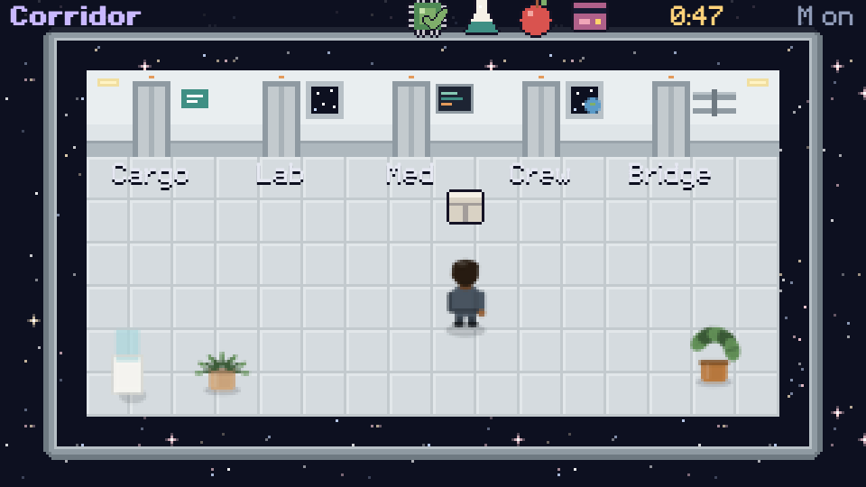

# Cozy Space Errands

First job on the station: deliver the mail. Mechanic Gus has four parcels in the cargo bay. Walk the corridor, open the doors, find Rosa, Doctor Lin, Officer Noor and the captain, and hand them their things. Then try to beat your best time.
A tiny, relaxing top-down game (3 to 5 minutes) in plain JavaScript: one HTML file, canvas, no engine. Rooms as tile grids, doors between rooms, dialog with portraits.

**▶ Play it:** [aquumgifts.github.io/cozy-space-errands](https://aquumgifts.github.io/cozy-space-errands/) · also on [itch.io](https://aquumgifts.itch.io/cozy-space-errands)

## How to play

- Arrows / WASD: walk (or tap where you want to go)
- Walk into a door on the back wall to go through it
- Walk up to someone to talk; Space, Enter or a tap moves the dialog on · M: mute

## Made only from free asset packs

Every pixel and sound comes from the free [Cozy Space set](https://itch.io/c/8266575):
[Interiors](https://aquumgifts.itch.io/cozy-space-interiors) (rooms, walls, sliding doors),
[Walking Crew](https://aquumgifts.itch.io/walking-crew) (the crew, walking in four directions),
[Station](https://aquumgifts.itch.io/cozy-space-station) (furniture),
[Portraits](https://aquumgifts.itch.io/cozy-space-portraits) and [Pixel Font](https://aquumgifts.itch.io/cozy-space-pixel-font) (the dialog),
[Icons & UI](https://aquumgifts.itch.io/cozy-space-icons-ui), [Music](https://aquumgifts.itch.io/cozy-space-music) and [SFX](https://aquumgifts.itch.io/cozy-space-sfx).
Everything in one download: [Cozy Space Complete](https://aquumgifts.itch.io/cozy-space-complete).

Run it locally with any static server (`python3 -m http.server 8000`).

## License

Code: MIT (see [LICENSE](LICENSE); comments are in Spanish). Assets: Cozy Space set by Aquum Studio, free to use in your games; don't resell the assets on their own.
The art is drawn in code and the music and sounds are synthesized with our own code: no AI image, music or sound generators.
